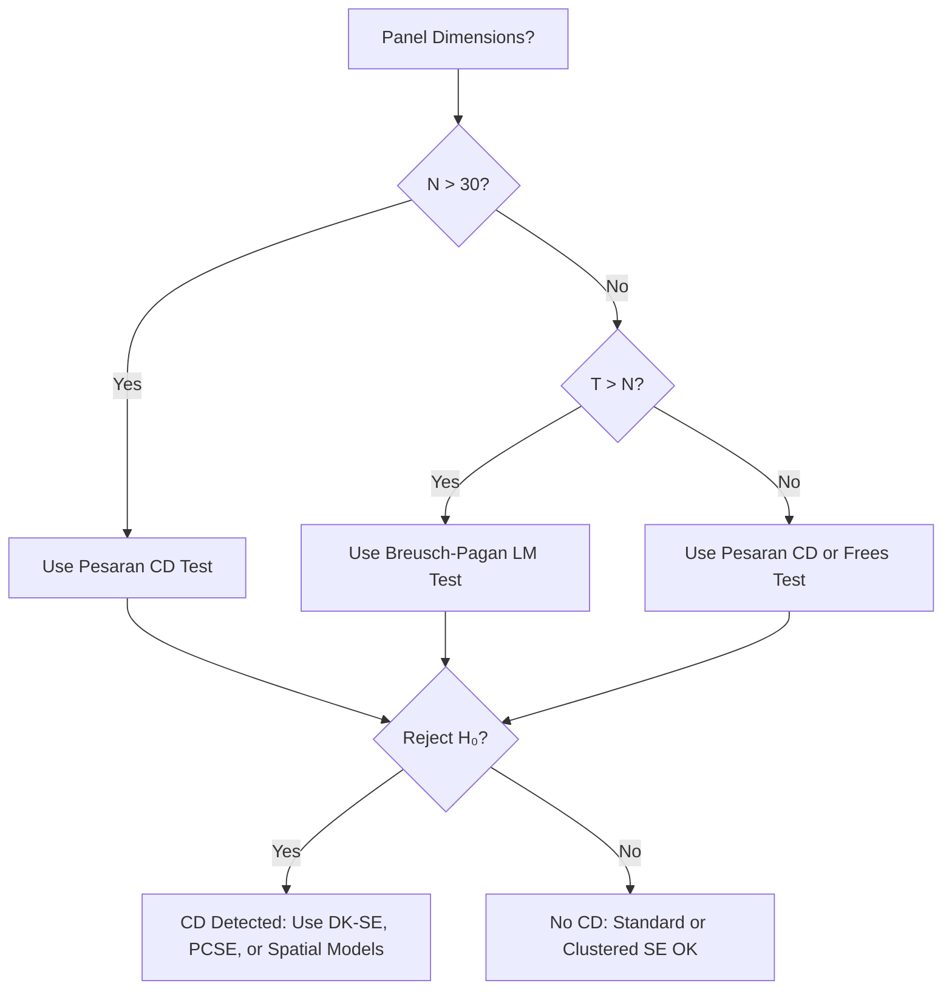

# Cross-Sectional Dependence Tests

## What Is Cross-Sectional Dependence?

Cross-sectional dependence (CD) occurs when the error terms are correlated across different entities at the same point in time:

$$\text{Cov}(\varepsilon_{it}, \varepsilon_{jt}) \neq 0 \quad \text{for } i \neq j$$

This means the residuals of entity $i$ and entity $j$ move together contemporaneously, violating the standard assumption of cross-sectional independence.

### Common Sources

- **Common macroeconomic shocks**: recessions, policy changes, or financial crises that affect all entities simultaneously
- **Spatial proximity**: neighboring regions or countries that share economic linkages
- **Institutional connections**: firms in the same industry, banks in the same network
- **Omitted common factors**: unobserved variables that affect all cross-sectional units

!!! warning "Consequences of Ignoring Cross-Sectional Dependence"
    - Entity-clustered standard errors are **insufficient** (they only handle within-entity serial correlation)
    - Standard errors may be severely **downward biased**, leading to spurious significance
    - Coefficient estimates may be **inconsistent** if CD results from omitted common factors
    - Unit root and cointegration tests lose their properties

## Available Tests

PanelBox provides three complementary tests for cross-sectional dependence:

| Test | H₀ | Distribution | Best For |
|------|-----|-------------|----------|
| [Pesaran CD](pesaran-cd.md) | No CD | N(0,1) | Large N, any T (default) |
| [Breusch-Pagan LM](bp-lm.md) | No CD | $\chi^2(N(N-1)/2)$ | Small N, large T |
| [Frees](../cross-sectional/index.md#frees-test) | No CD | z-statistic | Non-parametric alternative |

### Decision Guide



## Quick Comparison

```python
from panelbox import FixedEffects
from panelbox.datasets import load_grunfeld
from panelbox.validation.cross_sectional_dependence.pesaran_cd import PesaranCDTest
from panelbox.validation.cross_sectional_dependence.breusch_pagan_lm import BreuschPaganLMTest
from panelbox.validation.cross_sectional_dependence.frees import FreesTest

# Load data and estimate model
data = load_grunfeld()
fe = FixedEffects(data, "invest", ["value", "capital"], "firm", "year")
results = fe.fit()

# Run all three tests
pesaran = PesaranCDTest(results).run()
bp_lm = BreuschPaganLMTest(results).run()
frees = FreesTest(results).run()

print("Test              | Statistic | p-value  | Reject H₀?")
print("------------------|-----------|----------|----------")
print(f"Pesaran CD        | {pesaran.statistic:9.3f} | {pesaran.pvalue:.4f}  | "
      f"{'Yes' if pesaran.reject_null else 'No'}")
print(f"Breusch-Pagan LM  | {bp_lm.statistic:9.3f} | {bp_lm.pvalue:.4f}  | "
      f"{'Yes' if bp_lm.reject_null else 'No'}")
print(f"Frees             | {frees.statistic:9.3f} | {frees.pvalue:.4f}  | "
      f"{'Yes' if frees.reject_null else 'No'}")

# Average correlation from Pesaran test
print(f"\nAvg. abs. correlation: {pesaran.metadata['avg_abs_correlation']:.3f}")
```

## What to Do If Cross-Sectional Dependence Is Detected

### Option 1: Driscoll-Kraay Standard Errors (Recommended)

Robust to cross-sectional dependence, serial correlation, and heteroskedasticity:

```python
results_dk = fe.fit(cov_type="driscoll_kraay")
print(results_dk.summary())
```

### Option 2: Panel-Corrected Standard Errors (PCSE)

Beck and Katz (1995) standard errors designed for panels with CD:

```python
results_pcse = fe.fit(cov_type="pcse")
```

### Option 3: Time Fixed Effects

Common shocks may be absorbed by time dummies:

```python
fe_tw = FixedEffects(
    data, "invest", ["value", "capital"], "firm", "year",
    time_effects=True
)
results_tw = fe_tw.fit()

# Re-test after including time effects
pesaran_tw = PesaranCDTest(results_tw).run()
print(f"CD after time effects: {pesaran_tw.statistic:.3f}, p={pesaran_tw.pvalue:.4f}")
```

### Option 4: Spatial Panel Models

If the cross-sectional dependence has a spatial structure:

```python
from panelbox.models.spatial import SpatialLag

sar = SpatialLag(data, "invest", ["value", "capital"], "firm", "year", W=W)
results_spatial = sar.fit()
```

## Interpreting Results

All cross-sectional dependence tests return a `ValidationTestResult`:

```python
result.test_name       # Name of the test
result.statistic       # Test statistic
result.pvalue          # p-value
result.df              # Degrees of freedom (None for Pesaran CD, Frees)
result.reject_null     # True if H₀ rejected
result.conclusion      # Human-readable conclusion
result.metadata        # Test-specific details (correlations, entity counts)
```

### Average Correlation Guidelines

| $|\bar{\rho}|$ | Dependence Strength | Recommended Action |
|----------------|---------------------|---------------------|
| < 0.1 | Negligible | Clustered SE sufficient |
| 0.1 -- 0.3 | Moderate | Use Driscoll-Kraay SE |
| 0.3 -- 0.5 | Strong | Use PCSE or spatial models |
| > 0.5 | Very strong | Potential model misspecification; consider common factors |

## Frees Test

The Frees (1995) test is a **non-parametric** test for cross-sectional dependence based on Spearman rank correlations. It is robust to non-normality and outliers.

```python
from panelbox.validation.cross_sectional_dependence.frees import FreesTest

test = FreesTest(results)
result = test.run(alpha=0.05)

print(f"z-statistic: {result.statistic:.3f}")
print(f"P-value:     {result.pvalue:.4f}")

# Frees-specific metadata
meta = result.metadata
print(f"Q_F statistic:       {meta['q_frees_statistic']:.4f}")
print(f"Expected under H₀:  {meta['expected_qf_under_h0']:.4f}")
print(f"Critical value (5%): {meta['critical_values']['alpha_0.05']:.4f}")
print(f"Mean |rank corr.|:   {meta['mean_abs_rank_correlation']:.4f}")
```

The Frees test is especially useful when:

- You suspect non-normal residuals
- You want a test robust to outliers
- The Pesaran CD test may lack power due to positive and negative correlations canceling out

## Software Equivalents

| PanelBox | Stata | R (plm) |
|----------|-------|---------|
| `PesaranCDTest` | `xtcsd, pesaran abs` | `plm::pcdtest(, test="cd")` |
| `BreuschPaganLMTest` | `xtcsd, xttest2` | `plm::pcdtest(, test="lm")` |
| `FreesTest` | `xtcsd, frees` | `plm::pcdtest(, test="sclm")` |

## See Also

- [Serial Correlation Tests](../serial-correlation/index.md) -- testing for within-entity autocorrelation
- [Heteroskedasticity Tests](../heteroskedasticity/index.md) -- testing for non-constant variance
- [Driscoll-Kraay Standard Errors](../../inference/driscoll-kraay.md) -- SE robust to CD
- [Panel-Corrected Standard Errors](../../inference/pcse.md) -- Beck-Katz PCSE

## References

- Pesaran, M. H. (2004). "General diagnostic tests for cross section dependence in panels." *University of Cambridge Working Paper*, No. 0435.
- Breusch, T. S., & Pagan, A. R. (1980). "The Lagrange Multiplier test and its applications to model specification in econometrics." *Review of Economic Studies*, 47(1), 239-253.
- Frees, E. W. (1995). "Assessing cross-sectional correlation in panel data." *Journal of Econometrics*, 69(2), 393-414.
- De Hoyos, R. E., & Sarafidis, V. (2006). "Testing for cross-sectional dependence in panel-data models." *Stata Journal*, 6(4), 482-496.
- Beck, N., & Katz, J. N. (1995). "What to do (and not to do) with time-series cross-section data." *American Political Science Review*, 89(3), 634-647.
