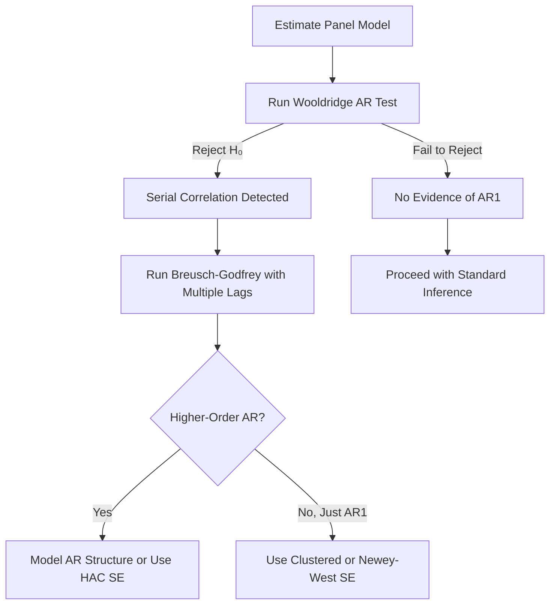

# Serial Correlation Tests

## What Is Serial Correlation?

Serial correlation (autocorrelation) occurs when the error terms of a panel model are correlated across time within the same entity:

$$\text{Cov}(\varepsilon_{it}, \varepsilon_{is}) \neq 0 \quad \text{for } t \neq s$$

In panel data, the most common form is **first-order autocorrelation (AR(1))**, where:

$$\varepsilon_{it} = \rho \, \varepsilon_{i,t-1} + v_{it}, \quad |\rho| < 1$$

!!! warning "Consequences of Ignoring Serial Correlation"
    - OLS coefficient estimates remain **consistent** but become **inefficient**
    - Standard errors are **biased** (typically downward), leading to inflated t-statistics
    - Confidence intervals are **too narrow**, causing over-rejection of null hypotheses
    - R-squared and F-statistics become **unreliable**

## Available Tests

PanelBox provides three complementary tests for detecting serial correlation:

| Test | H₀ | Order | Model Type | Best For |
|------|-----|-------|-----------|----------|
| [Wooldridge AR](wooldridge.md) | No AR(1) | First-order | FE/RE | Default first test |
| [Breusch-Godfrey](breusch-godfrey.md) | No AR(p) | Higher-order | Any | Detecting higher-order AR |
| [Baltagi-Wu LBI](baltagi-wu.md) | No AR(1) | First-order | Unbalanced | Unbalanced panels |

## Recommended Workflow



### Step-by-Step Testing

```python
from panelbox import FixedEffects
from panelbox.datasets import load_grunfeld
from panelbox.validation.serial_correlation.wooldridge_ar import WooldridgeARTest
from panelbox.validation.serial_correlation.breusch_godfrey import BreuschGodfreyTest
from panelbox.validation.serial_correlation.baltagi_wu import BaltagiWuTest

# Load data and estimate model
data = load_grunfeld()
fe = FixedEffects(data, "invest", ["value", "capital"], "firm", "year")
results = fe.fit()

# Step 1: Wooldridge test (default first check)
wooldridge = WooldridgeARTest(results)
w_result = wooldridge.run(alpha=0.05)
print(f"Wooldridge F-stat: {w_result.statistic:.3f}, p-value: {w_result.pvalue:.4f}")
print(w_result.conclusion)

# Step 2: If rejected, check for higher-order AR
if w_result.reject_null:
    bg = BreuschGodfreyTest(results)
    for lag in [1, 2, 3]:
        bg_result = bg.run(lags=lag)
        print(f"  BG AR({lag}): LM={bg_result.statistic:.3f}, p={bg_result.pvalue:.4f}")

# Step 3: For unbalanced panels, also check Baltagi-Wu
bw = BaltagiWuTest(results)
bw_result = bw.run()
print(f"Baltagi-Wu z-stat: {bw_result.statistic:.3f}, p-value: {bw_result.pvalue:.4f}")
print(f"  Estimated rho: {bw_result.metadata['rho_estimate']:.4f}")
```

## What to Do If Serial Correlation Is Detected

### Option 1: Clustered Standard Errors (Recommended)

Clustering by entity accounts for arbitrary within-entity correlation:

```python
results_cluster = fe.fit(cov_type="clustered")
print(results_cluster.summary())
```

### Option 2: Newey-West (HAC) Standard Errors

Robust to both heteroskedasticity and autocorrelation:

```python
results_nw = fe.fit(cov_type="newey_west")
```

### Option 3: Driscoll-Kraay Standard Errors

Robust to serial correlation, heteroskedasticity, and cross-sectional dependence:

```python
results_dk = fe.fit(cov_type="driscoll_kraay")
```

### Option 4: Model the AR Structure

For dynamic panels, incorporate the autoregressive structure explicitly:

```python
from panelbox.gmm import SystemGMM

# System GMM handles AR dynamics directly
gmm = SystemGMM(
    data, "invest", ["invest"], ["value", "capital"],
    "firm", "year", max_lags=2
)
gmm_results = gmm.fit()
```

## Interpreting Results

All serial correlation tests return a `ValidationTestResult` with:

```python
result.test_name       # Name of the test
result.statistic       # Test statistic (F, LM, or z)
result.pvalue          # p-value
result.df              # Degrees of freedom
result.reject_null     # True if H₀ rejected at chosen alpha
result.conclusion      # Human-readable conclusion
result.metadata        # Test-specific additional information
```

| p-value | Decision | Action |
|---------|----------|--------|
| < 0.01 | Strong rejection | Use robust SE (clustered or HAC) |
| 0.01 -- 0.05 | Rejection | Use robust SE |
| 0.05 -- 0.10 | Borderline | Consider robust SE as a precaution |
| > 0.10 | Fail to reject | Standard SE likely adequate |

## Software Equivalents

| PanelBox | Stata | R (plm) |
|----------|-------|---------|
| `WooldridgeARTest` | `xtserial y x1 x2` | `plm::pwartest()` |
| `BreuschGodfreyTest` | `xttest1` | `plm::pbgtest()` |
| `BaltagiWuTest` | `xtserial` (variant) | `plm::pbltest()` |

## See Also

- [Heteroskedasticity Tests](../heteroskedasticity/index.md) -- testing for non-constant variance
- [Cross-Sectional Dependence Tests](../cross-sectional/index.md) -- testing for correlation across entities
- [Newey-West Standard Errors](../../inference/newey-west.md) -- HAC standard errors
- [Clustered Standard Errors](../../inference/clustered.md) -- cluster-robust inference

## References

- Wooldridge, J. M. (2002). *Econometric Analysis of Cross Section and Panel Data*. MIT Press, Section 10.4.1.
- Breusch, T. S. (1978). "Testing for autocorrelation in dynamic linear models." *Australian Economic Papers*, 17(31), 334-355.
- Godfrey, L. G. (1978). "Testing against general autoregressive and moving average error models when the regressors include lagged dependent variables." *Econometrica*, 46(6), 1293-1301.
- Baltagi, B. H., & Wu, P. X. (1999). "Unequally spaced panel data regressions with AR(1) disturbances." *Econometric Theory*, 15(6), 814-823.
- Drukker, D. M. (2003). "Testing for serial correlation in linear panel-data models." *Stata Journal*, 3(2), 168-177.
