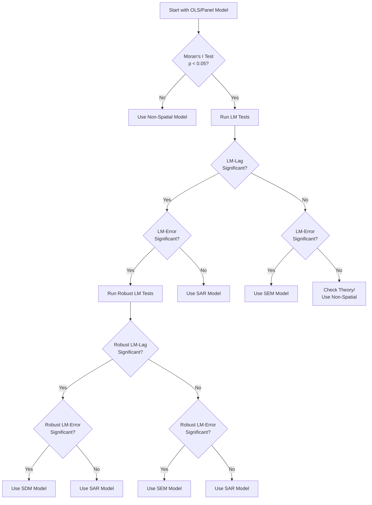

# Guide: Choosing the Right Spatial Model

## Quick Decision Guide

This flowchart will help you quickly identify the appropriate spatial model:



## Step-by-Step Process

### Step 1: Start with a Non-Spatial Model

Always begin with a standard panel model to establish baseline:

```python
import panelbox as pb

# Estimate baseline fixed effects model
fe_model = pb.FixedEffects(
    formula='y ~ x1 + x2 + x3',
    data=panel_data,
    entity_col='region',
    time_col='year'
)
fe_result = fe_model.fit()
print(fe_result.summary())
```

### Step 2: Test for Spatial Autocorrelation

Test if spatial dependence exists in your residuals:

```python
# Create spatial weight matrix
W = pb.SpatialWeights.from_contiguity(gdf, method='queen')

# Test residuals for spatial autocorrelation
moran_test = pb.MoranIPanelTest(
    fe_result.residuals,
    W,
    panel_data['region'],
    panel_data['year']
)
moran_result = moran_test.run()

print(f"Moran's I: {moran_result.statistic:.4f}")
print(f"p-value: {moran_result.pvalue:.4f}")

if moran_result.pvalue >= 0.05:
    print("No significant spatial autocorrelation. Use non-spatial model.")
else:
    print("Significant spatial autocorrelation detected. Proceed to LM tests.")
```

### Step 3: Run Lagrange Multiplier Tests

Identify the type of spatial dependence:

```python
# Run all LM tests at once
lm_results = pb.run_lm_tests(fe_result, W)

print("LM Test Results:")
print(f"  LM-Lag:    stat={lm_results['lm_lag']['statistic']:.3f}, "
      f"p={lm_results['lm_lag']['pvalue']:.3f}")
print(f"  LM-Error:  stat={lm_results['lm_error']['statistic']:.3f}, "
      f"p={lm_results['lm_error']['pvalue']:.3f}")
print(f"  Robust LM-Lag:   stat={lm_results['robust_lm_lag']['statistic']:.3f}, "
      f"p={lm_results['robust_lm_lag']['pvalue']:.3f}")
print(f"  Robust LM-Error: stat={lm_results['robust_lm_error']['statistic']:.3f}, "
      f"p={lm_results['robust_lm_error']['pvalue']:.3f}")
print(f"\nRecommended model: {lm_results['recommendation']}")
```

### Step 4: Estimate the Recommended Model

Based on test results, estimate the appropriate spatial model:

```python
if lm_results['recommendation'] == 'SAR':
    model = pb.SpatialLag(
        formula='y ~ x1 + x2 + x3',
        data=panel_data,
        entity_col='region',
        time_col='year',
        W=W
    )
elif lm_results['recommendation'] == 'SEM':
    model = pb.SpatialError(
        formula='y ~ x1 + x2 + x3',
        data=panel_data,
        entity_col='region',
        time_col='year',
        W=W
    )
elif lm_results['recommendation'] == 'SDM':
    model = pb.SpatialDurbin(
        formula='y ~ x1 + x2 + x3',
        data=panel_data,
        entity_col='region',
        time_col='year',
        W=W
    )
else:
    print("No spatial model needed")
    model = None

if model:
    result = model.fit(effects='fixed')
    print(result.summary())
```

### Step 5: Validate the Model

Ensure the spatial model has adequately captured spatial dependence:

```python
# Test residuals from spatial model
spatial_residuals = result.residuals
moran_post = pb.MoranIPanelTest(
    spatial_residuals,
    W,
    panel_data['region'],
    panel_data['year']
)
moran_post_result = moran_post.run()

print(f"Post-estimation Moran's I: {moran_post_result.statistic:.4f}")
print(f"Post-estimation p-value: {moran_post_result.pvalue:.4f}")

if moran_post_result.pvalue >= 0.05:
    print("✓ Spatial autocorrelation successfully removed")
else:
    print("⚠ Residual spatial autocorrelation remains")
    print("Consider: different W, SDM/GNS model, or omitted variables")
```

## Decision Rules Explained

### When Only LM-Lag is Significant

**Use SAR Model** because:
- Indicates spatial dependence in the dependent variable
- Suggests spillover effects between regions
- Implies multiplier effects are present

**Real-world interpretation**:
- "My outcome depends on my neighbors' outcomes"
- Examples: GDP growth, housing prices, crime rates

### When Only LM-Error is Significant

**Use SEM Model** because:
- Indicates spatial clustering in unobservables
- Suggests omitted spatially correlated variables
- No direct interaction between units

**Real-world interpretation**:
- "Neighboring regions face similar unobserved shocks"
- Examples: Weather effects, cultural factors, measurement error

### When Both LM Tests are Significant

**Check Robust LM Tests**:
- Robust tests control for the other form of dependence
- More reliable for model selection
- Follow the same logic with robust versions

**If both robust tests significant**:
- Use SDM (Spatial Durbin Model)
- Most flexible specification
- Allows testing down to simpler models

## Advanced Considerations

### Multiple Spatial Weight Matrices

Test with different W specifications:

```python
# Define multiple weight matrices
W_configs = {
    'contiguity': pb.SpatialWeights.from_contiguity(gdf, 'queen'),
    'knn5': pb.SpatialWeights.from_knn(coords, k=5),
    'knn10': pb.SpatialWeights.from_knn(coords, k=10),
    'distance50': pb.SpatialWeights.from_distance(coords, threshold=50)
}

# Test each W
recommendations = {}
for name, W in W_configs.items():
    lm_results = pb.run_lm_tests(fe_result, W)
    recommendations[name] = lm_results['recommendation']
    print(f"{name}: {lm_results['recommendation']}")

# If consistent across W matrices, confident in model choice
if len(set(recommendations.values())) == 1:
    print(f"Consistent recommendation: {list(recommendations.values())[0]}")
else:
    print("Mixed recommendations. Consider SDM for robustness.")
```

### Theory-Driven Selection

Sometimes economic theory should override statistical tests:

```python
def theory_based_selection(context):
    """
    Select model based on economic theory.
    """
    if context == 'fiscal_competition':
        # Governments respond to neighbors' tax rates
        return 'SAR'
    elif context == 'weather_shocks':
        # Common unobserved shocks
        return 'SEM'
    elif context == 'knowledge_spillovers':
        # Complex diffusion process
        return 'SDM'
    elif context == 'housing_markets':
        # Both direct spillovers and common amenities
        return 'SDM'
    else:
        # Use statistical tests
        return None

# Combine theory and statistical evidence
statistical_rec = lm_results['recommendation']
theory_rec = theory_based_selection('fiscal_competition')

if theory_rec and statistical_rec != theory_rec:
    print(f"Theory suggests {theory_rec}, tests suggest {statistical_rec}")
    print("Consider estimating both and comparing")
```

### Model Nesting and Testing

Test restrictions when using general models:

```python
# Estimate general model (SDM)
sdm = pb.SpatialDurbin(formula, data, entity_col, time_col, W)
sdm_result = sdm.fit()

# Estimate nested models
sar = pb.SpatialLag(formula, data, entity_col, time_col, W)
sar_result = sar.fit()

sem = pb.SpatialError(formula, data, entity_col, time_col, W)
sem_result = sem.fit()

# Likelihood Ratio tests
from scipy.stats import chi2

# Test SDM vs SAR (H0: θ = 0)
lr_sar = 2 * (sdm_result.llf - sar_result.llf)
p_sar = chi2.sf(lr_sar, df=len(sdm_result.theta))
print(f"SDM vs SAR: LR={lr_sar:.3f}, p={p_sar:.3f}")

# Test SDM vs SEM (H0: θ + ρβ = 0)
# This requires a Wald test
from panelbox.tests import wald_test
wald_stat = wald_test(sdm_result, 'theta + rho * beta = 0')
print(f"SDM vs SEM: Wald={wald_stat['statistic']:.3f}, "
      f"p={wald_stat['pvalue']:.3f}")
```

## Common Scenarios

### Scenario 1: Regional Economic Growth

```python
# Economic theory: Growth spillovers between regions
# Expected model: SAR or SDM

# 1. Create economic distance weights
W_econ = pb.SpatialWeights.from_economic_distance(
    trade_flows,  # Trade matrix
    normalize='row'
)

# 2. Test and estimate
lm_results = pb.run_lm_tests(ols_result, W_econ)
# Usually finds significant LM-Lag → SAR model
```

### Scenario 2: Environmental Quality

```python
# Theory: Common environmental factors
# Expected model: SEM

# 1. Create geographic contiguity weights
W_geo = pb.SpatialWeights.from_contiguity(gdf)

# 2. Test and estimate
lm_results = pb.run_lm_tests(ols_result, W_geo)
# Often finds significant LM-Error → SEM model
```

### Scenario 3: Innovation Diffusion

```python
# Theory: Complex knowledge spillovers
# Expected model: SDM

# 1. Create multiple weight matrices
W_geo = pb.SpatialWeights.from_contiguity(gdf)
W_tech = pb.SpatialWeights.from_similarity(
    patent_citations,
    metric='cosine'
)

# 2. Estimate SDM directly based on theory
sdm = pb.SpatialDurbin(formula, data, entity_col, time_col, W_tech)
sdm_result = sdm.fit()

# 3. Decompose effects
effects = pb.compute_spatial_effects(sdm_result)
print(effects.summary())
```

## Troubleshooting

### Problem: All tests are insignificant but theory suggests spatial dependence

**Solutions**:
1. Check weight matrix specification
2. Consider nonlinear relationships
3. Look for spatial heterogeneity
4. Test in subsamples

### Problem: Different W matrices give different recommendations

**Solutions**:
1. Use SDM (most general)
2. Report multiple specifications
3. Let theory guide choice
4. Consider model averaging

### Problem: Residual spatial autocorrelation after spatial model

**Solutions**:
1. Try SDM or GNS model
2. Check for misspecification
3. Consider spatial heterogeneity
4. Add spatial fixed effects

## Summary Checklist

✅ **Before choosing a spatial model:**
- [ ] Estimate non-spatial baseline
- [ ] Test for spatial autocorrelation
- [ ] Consider economic theory
- [ ] Define appropriate W matrix

✅ **Statistical testing sequence:**
- [ ] Moran's I test
- [ ] LM-Lag and LM-Error tests
- [ ] Robust LM tests if needed
- [ ] Compare information criteria

✅ **After estimation:**
- [ ] Check residual autocorrelation
- [ ] Test model restrictions
- [ ] Validate with different W
- [ ] Interpret effects correctly

## References

1. Anselin, L., Bera, A.K., Florax, R. and Yoon, M.J. (1996). Simple diagnostic tests for spatial dependence. *Regional Science and Urban Economics*, 26(1), 77-104.
2. Elhorst, J.P. (2014). *Spatial Econometrics: From Cross-Sectional Data to Spatial Panels*. Springer.
3. LeSage, J. and Pace, R.K. (2009). *Introduction to Spatial Econometrics*. Chapman & Hall/CRC.
