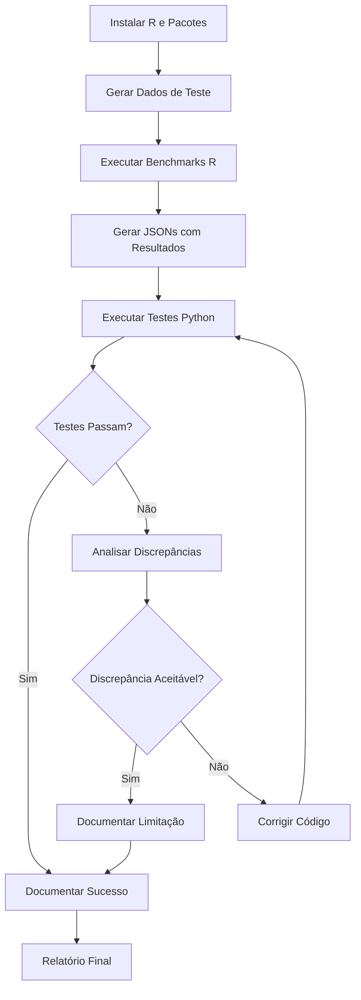

# FASE 5: Validação contra R - Sumário Executivo

## Visão Geral

A Fase 5 estabelece validação rigorosa dos modelos de resposta limitada implementados no PanelBox contra implementações de referência em R. Esta validação é crucial para garantir a correção estatística e confiabilidade dos modelos.

## Objetivos

1. **Validação Estatística**: Confirmar que os modelos PanelBox produzem resultados equivalentes aos pacotes R estabelecidos
2. **Identificação de Discrepâncias**: Detectar e documentar diferenças sistemáticas
3. **Estabelecimento de Benchmarks**: Criar suite de testes automatizados para validação contínua
4. **Documentação de Limitações**: Identificar e comunicar limitações conhecidas

## Modelos Validados

### Modelos Binários
- **PooledLogit** vs R `glm(..., family=binomial(link="logit"))`
- **PooledProbit** vs R `glm(..., family=binomial(link="probit"))`
- **FixedEffectsLogit** vs R `survival::clogit(...)`

### Modelos Censurados
- **PooledTobit** vs R `censReg::censReg(...)`

### Modelos de Contagem
- **PooledPoisson** vs R `glm(..., family=poisson)`
- **PoissonFixedEffects** vs R `plm::pglm(..., model="within")`
- **NegativeBinomial** vs R `MASS::glm.nb(...)`

## Estrutura dos Arquivos

```
tests/resposta_limitada/
├── FASE5_SUMMARY.md              # Este arquivo - visão geral
├── FASE5_CHECKLIST.md            # Checklist detalhado de execução
├── README_R_VALIDATION.md        # Guia passo-a-passo para usuários
├── VALIDATION_REPORT.md          # Template para relatório de resultados
├── generate_test_data.py         # Script para gerar dados de teste
├── test_r_validation.py          # Suite de testes pytest
├── r/
│   ├── benchmark_discrete.R      # Benchmarks R para modelos binários
│   ├── benchmark_tobit.R         # Benchmarks R para modelos censurados
│   ├── benchmark_count.R         # Benchmarks R para modelos de contagem
│   └── results/                  # JSONs com resultados R (gerados)
└── data/                         # Dados de teste (gerados)
```

## Workflow de Validação



## Quick Start

### Para Executar Validação Completa

```bash
# 1. Instalar pacotes R (uma vez)
R
> install.packages(c("plm", "jsonlite", "MASS", "survival", "censReg",
                     "mfx", "margins", "sandwich", "lmtest"))
> quit()

# 2. Gerar dados de teste
cd tests/resposta_limitada/
python generate_test_data.py

# 3. Executar benchmarks R
cd r/
Rscript benchmark_discrete.R
Rscript benchmark_tobit.R
Rscript benchmark_count.R

# 4. Executar testes Python
cd ../..  # volta para raiz do projeto
pytest tests/resposta_limitada/test_r_validation.py -v

# 5. Preencher relatório
# Editar VALIDATION_REPORT.md com resultados
```

## Critérios de Sucesso

### Tolerâncias Definidas

| Métrica | Tolerância | Justificativa |
|---------|------------|---------------|
| Coeficientes | 5% (COEF_RTOL = 0.05) | Diferenças de otimização aceitáveis |
| Erros Padrão | 10% (SE_RTOL = 0.10) | Métodos numéricos podem diferir |
| Log-likelihood | 0.1% | Deve ser quase idêntico |
| Efeitos Marginais | 10% (ME_RTOL = 0.10) | Depende de coefs e derivadas numéricas |

### Critérios de Aprovação

**APROVADO**: ≥ 95% dos testes passam, com discrepâncias documentadas

**APROVAÇÃO CONDICIONAL**: 85-95% dos testes passam, requer documentação extensa

**REQUER TRABALHO**: < 85% dos testes passam, indica problemas de implementação

## Principais Desafios

### 1. Diferenças de Otimização
- **Problema**: Python (scipy) e R usam algoritmos diferentes
- **Impacto**: Pequenas diferenças em coeficientes (< 1%)
- **Solução**: Verificar convergência em ambos os lados

### 2. Cálculo de Erros Padrão
- **Problema**: Métodos numéricos para Hessiana podem diferir
- **Impacto**: Diferenças em SE até 10%
- **Solução**: Documentar método usado em cada implementação

### 3. Efeitos Fixos
- **Problema**: Critérios para remover observações podem diferir
- **Impacto**: Amostras efetivas diferentes
- **Solução**: Comparar lógica de remoção, documentar diferenças

### 4. Efeitos Aleatórios (Futuro)
- **Problema**: Métodos de integração numérica (quadratura)
- **Impacto**: Diferenças até 15%
- **Solução**: Usar mesmo número de pontos de quadratura

## Documentos de Referência

1. **README_R_VALIDATION.md**: Guia completo passo-a-passo
   - Instalação de pré-requisitos
   - Instruções de execução
   - Troubleshooting

2. **FASE5_CHECKLIST.md**: Checklist detalhado
   - Cada passo da validação
   - Espaços para preencher resultados
   - Registro de decisões

3. **VALIDATION_REPORT.md**: Template de relatório
   - Tabelas para comparação de resultados
   - Seções para análise de discrepâncias
   - Conclusões e recomendações

## Resultados Esperados

Ao completar a Fase 5, você terá:

✅ Suite de testes automatizada comparando PanelBox vs R

✅ Benchmark de referência para cada modelo

✅ Documentação de discrepâncias conhecidas

✅ Relatório de validação completo

✅ Confiança estatística nos resultados do PanelBox

## Uso Contínuo

### Durante Desenvolvimento
- Execute testes após modificações em modelos
- Adicione novos casos de teste para edge cases
- Mantenha tolerâncias atualizadas

### Antes de Releases
- Execute validação completa
- Atualize VALIDATION_REPORT.md
- Verifique que taxa de sucesso ≥ 95%

### Em CI/CD
- Configure execução automática de testes Python
- Configure alertas para regressões
- Mantenha resultados R atualizados

## Extensões Futuras

### Validação Adicional
- [ ] Comparar com Stata (se disponível)
- [ ] Comparar com statsmodels (Python)
- [ ] Adicionar modelos Random Effects quando implementados
- [ ] Adicionar modelos dinâmicos

### Testes de Robustez
- [ ] Diferentes tamanhos de amostra (N, T)
- [ ] Diferentes níveis de balanceamento
- [ ] Presença de outliers
- [ ] Missing data

### Automação
- [ ] Script único para executar tudo
- [ ] Geração automática de relatório
- [ ] Visualizações de discrepâncias
- [ ] Dashboard de validação

## Contato e Suporte

**Para problemas com:**
- **Instalação R**: Ver [CRAN](https://cran.r-project.org/)
- **Execução dos scripts**: Ver README_R_VALIDATION.md seção Troubleshooting
- **Interpretação de resultados**: Ver VALIDATION_REPORT.md seção Known Discrepancies
- **Bugs no código**: Abrir issue no GitHub

## Referências Técnicas

### Livros
- Greene, W. H. (2003). *Econometric Analysis* (5th ed.)
- Wooldridge, J. M. (2010). *Econometric Analysis of Cross Section and Panel Data* (2nd ed.)
- Cameron & Trivedi (2005). *Microeconometrics: Methods and Applications*

### Papers
- Croissant & Millo (2008). "Panel Data Econometrics in R: The plm Package"
- Zeileis (2004). "Econometric Computing with HC and HAC Covariance Matrix Estimators"

### Documentação R
- [plm package](https://cran.r-project.org/package=plm)
- [censReg package](https://cran.r-project.org/package=censReg)
- [MASS package](https://cran.r-project.org/package=MASS)

## Changelog

| Versão | Data | Mudanças |
|--------|------|----------|
| 1.0 | 2025-XX-XX | Versão inicial - estrutura completa de validação |

---

**Status**: ⚠️ AGUARDANDO EXECUÇÃO

**Próxima Ação**: Seguir passos em README_R_VALIDATION.md

**Tempo Estimado**: 1-2 horas para execução completa

---

*Este documento é parte da FASE 5: Validação contra R do projeto PanelBox*
